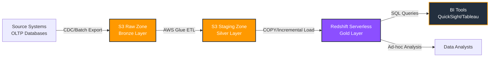
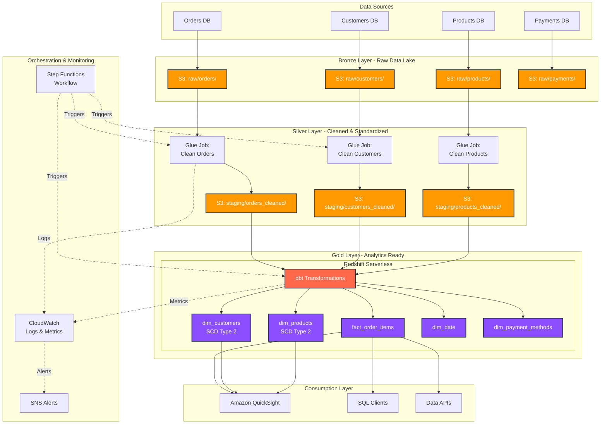
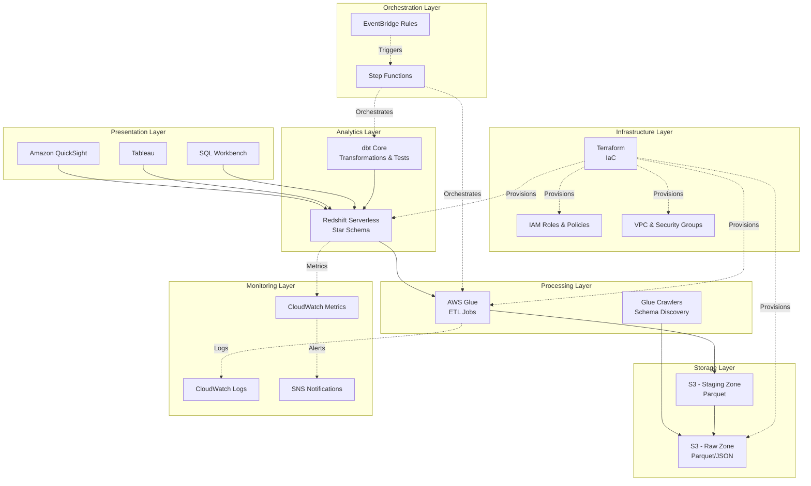
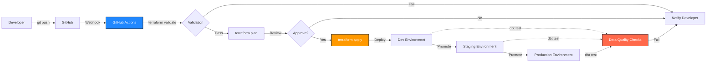

# Architecture Diagram

## High-Level Data Flow



## Detailed Architecture



## Data Model - Star Schema

```mermaid
erDiagram
    fact_order_items ||--o{ dim_customers : "customer_key"
    fact_order_items ||--o{ dim_products : "product_key"
    fact_order_items ||--o{ dim_date : "order_date_key"
    fact_order_items ||--o{ dim_payment_methods : "payment_method_key"
    fact_order_items ||--o{ dim_shipment_status : "shipment_status_key"
    
    fact_order_items {
        bigint order_item_key PK
        bigint order_key
        bigint customer_key FK
        bigint product_key FK
        int order_date_key FK
        int payment_method_key FK
        int shipment_status_key FK
        int quantity
        decimal unit_price
        decimal discount_amount
        decimal total_amount
        timestamp created_at
    }
    
    dim_customers {
        bigint customer_key PK
        string customer_id NK
        string customer_name
        string email
        string country
        string segment
        date valid_from
        date valid_to
        boolean is_current
    }
    
    dim_products {
        bigint product_key PK
        string product_id NK
        string product_name
        string category
        string subcategory
        decimal list_price
        date valid_from
        date valid_to
        boolean is_current
    }
    
    dim_date {
        int date_key PK
        date date_value
        int year
        int quarter
        int month
        int day_of_week
        string month_name
        boolean is_weekend
    }
    
    dim_payment_methods {
        int payment_method_key PK
        string payment_method_name
        string payment_type
    }
    
    dim_shipment_status {
        int shipment_status_key PK
        string status_name
        string status_category
    }
```

## Technology Stack Layers



## Deployment Pipeline


